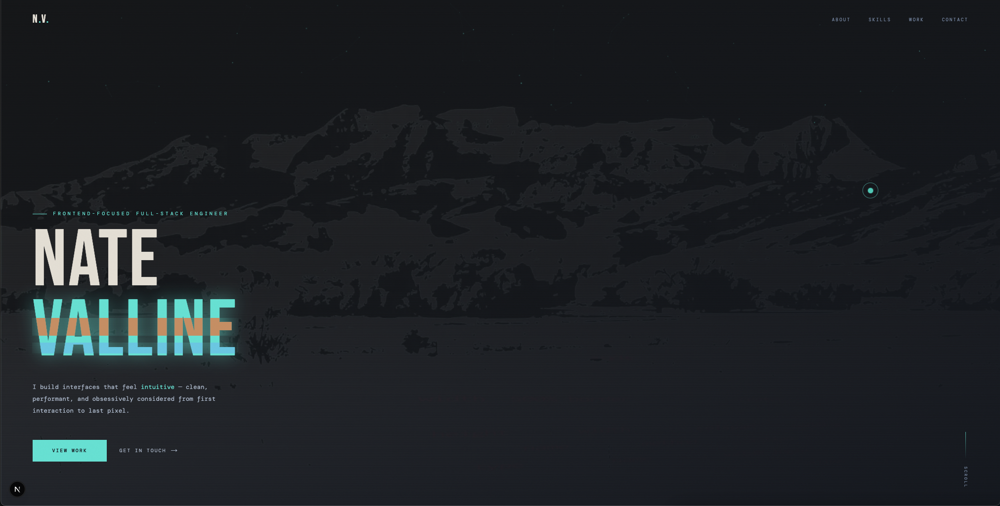

# Nate Valline Portfolio V5

> This portfolio is my fifth version. For this version I have incorporated some of the latest technologies that I have learned.

#### [View The Site](https://natevalline.dev) - The project is live.

---

### Table of Contents

- [Description](#description)
- [Technologies](#technologies)
- [Installation](#installation)
- [How To Use](#how-to-use)
- [Test(s)](#tests)
- [Contributors](#contributors)
- [Questions](#questions)
- [License](#license)

---

## Description

This application was built to showcase my most up-to-date coding knowledge, professional information and projects that I have created.

This Next.js application is fully responsive and built with a modern stack including TypeScript, Tailwind CSS v4, and the Next.js App Router.

[Back To The Top](#project-name)

---

## Technologies

- Next.js 16 (App Router)
- React 19
- TypeScript
- Tailwind CSS v4
- Node.js
- HTML

[Back To The Top](#project-name)

---

## Installation

Simply click the following link to load the application in your browser.

#### [View The Site](https://natevalline.dev/) - The project is live.

[Back To The Top](#project-name)

---

## How To Use

Once the application is loaded in the browser, enjoy expoloring the website.

[Back To The Top](#project-name)

---

## Tests

There are no tests.

[Back To The Top](#project-name)

---

## Contributors

- Nate Valline

[Back To The Top](#project-name)

---

## Questions

Please contact the following for any questions.

 => nate@natevalline.dev

[Back To The Top](#project-name)

---

## License

Copyright (c) 2026 Nate Valline

[Back To The Top](#project-name)

---
